# Stripe Checkout Flow Diagrams

## Current Flow (BROKEN) 🔴

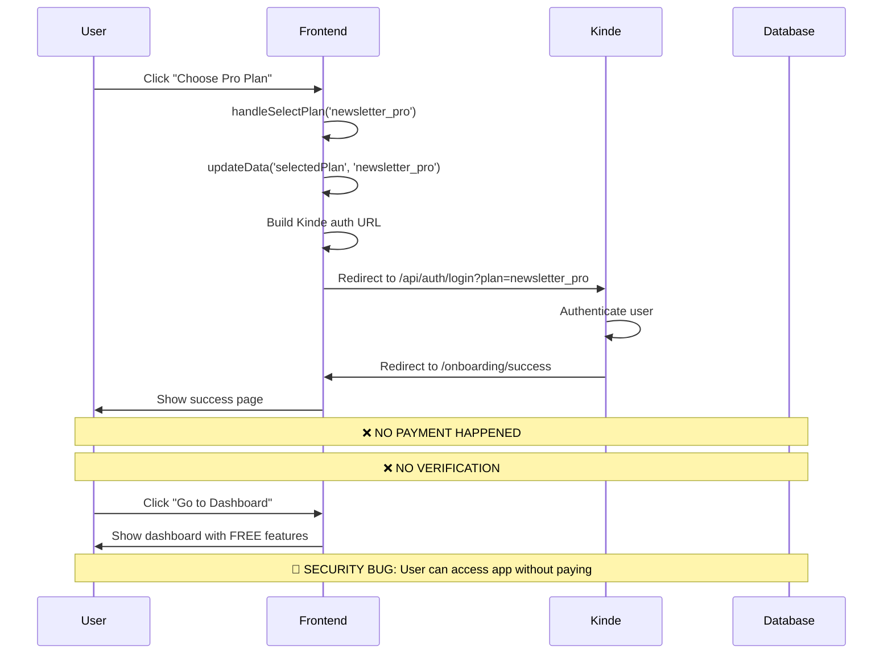

### What's Wrong:
1. **No Stripe Checkout** - Never calls `/api/stripe/checkout`
2. **No Payment** - User never enters credit card
3. **No Verification** - Success page doesn't check payment
4. **No Webhook** - Database never updated with subscription
5. **Critical Security Flaw** - Users can access paid features without paying

---

## Proposed Flow (FIXED) ✅

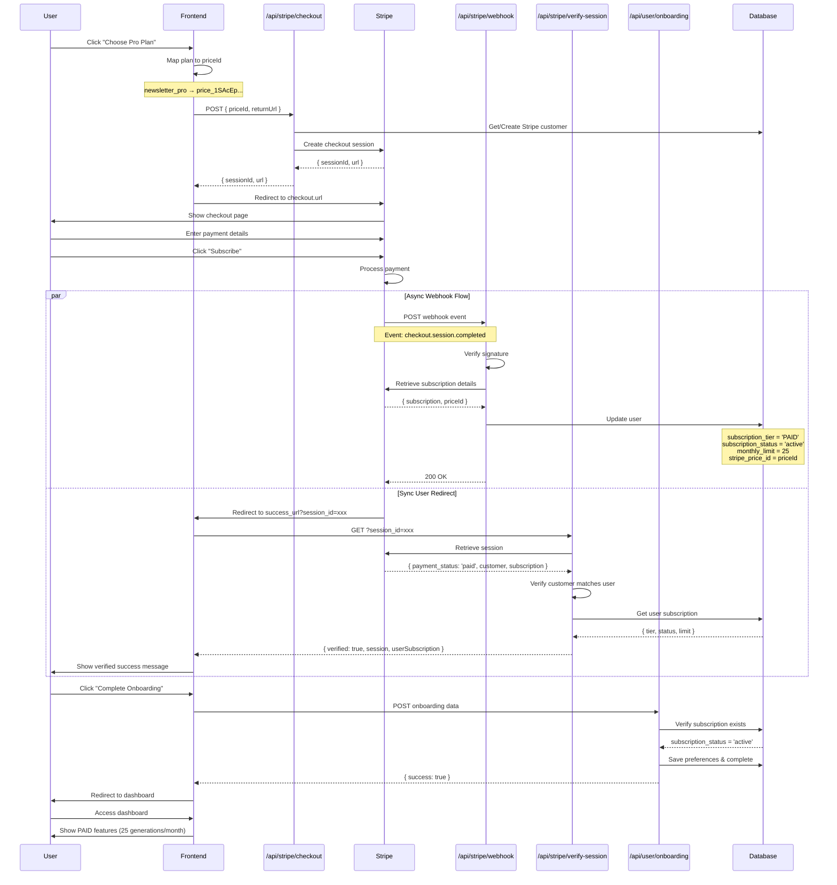

### Why This Works:
1. ✅ **Real Stripe Checkout** - User enters payment on Stripe.com
2. ✅ **Payment Verification** - Backend verifies payment completed
3. ✅ **Webhook Updates DB** - Subscription data synced to database
4. ✅ **Session Verification** - Success page confirms payment before proceeding
5. ✅ **Secure** - Cannot bypass payment to access features

---

## Free Trial Flow ✅

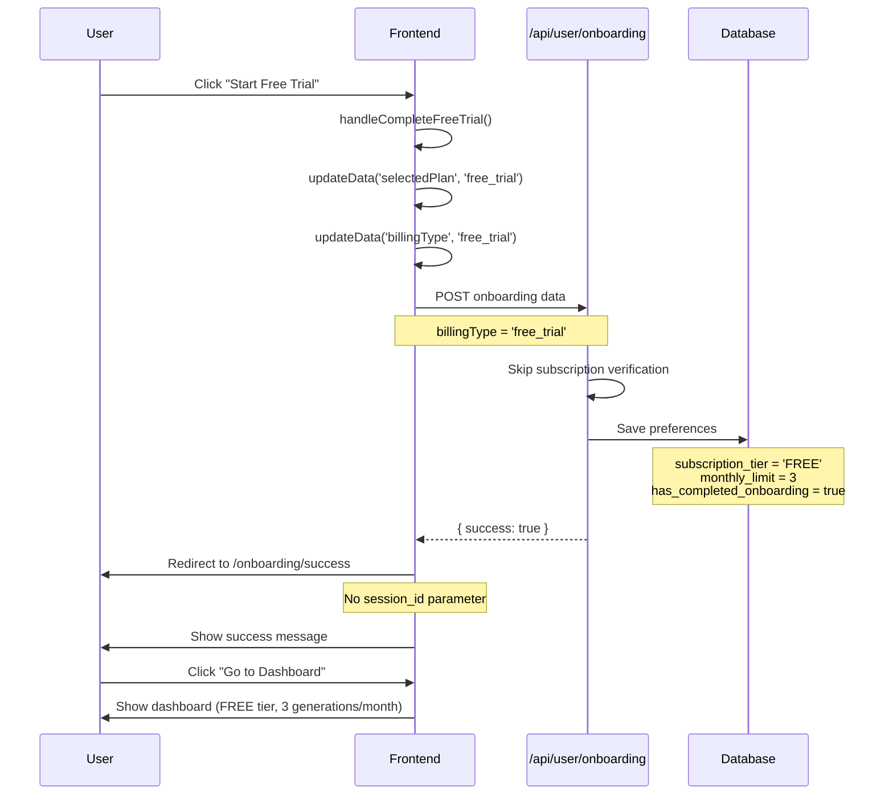

---

## Webhook Event Handling 🔔

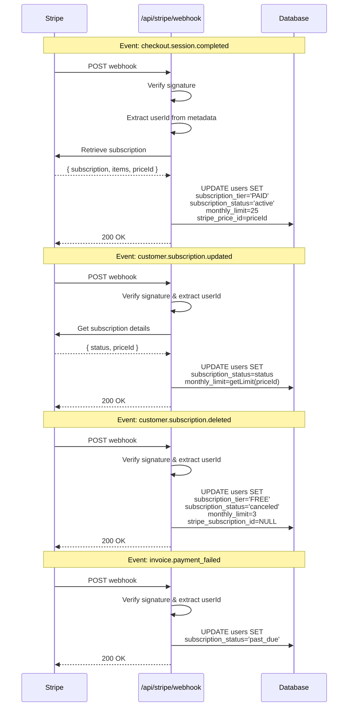

---

## Session Verification Flow 🔍

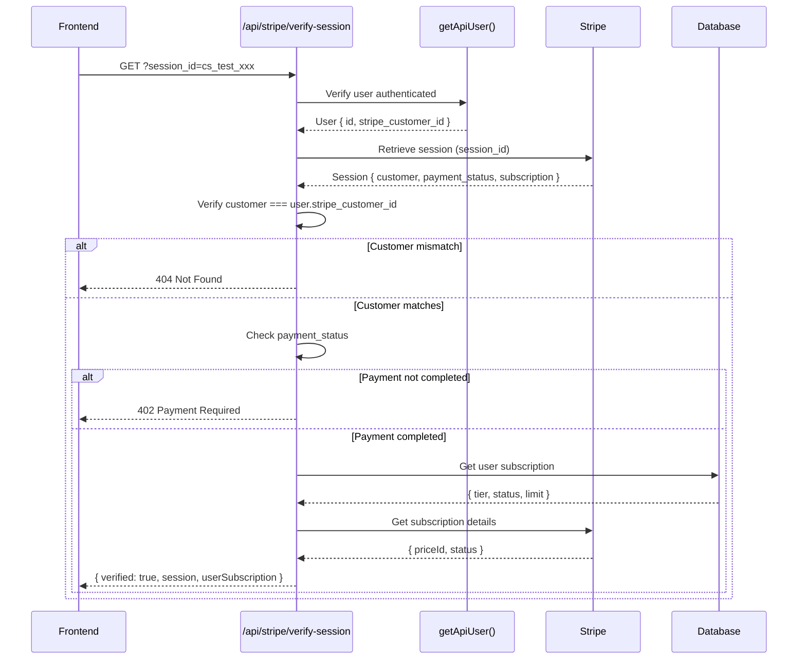

---

## Error Handling Flow ❌

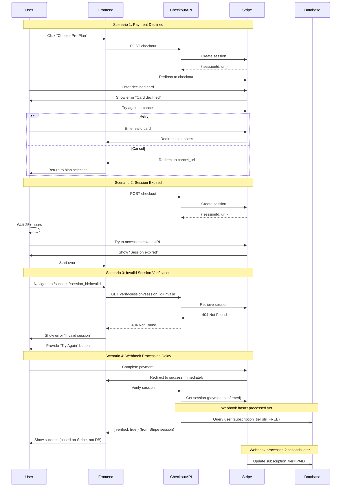

---

## Multi-Tier Support Flow 📊

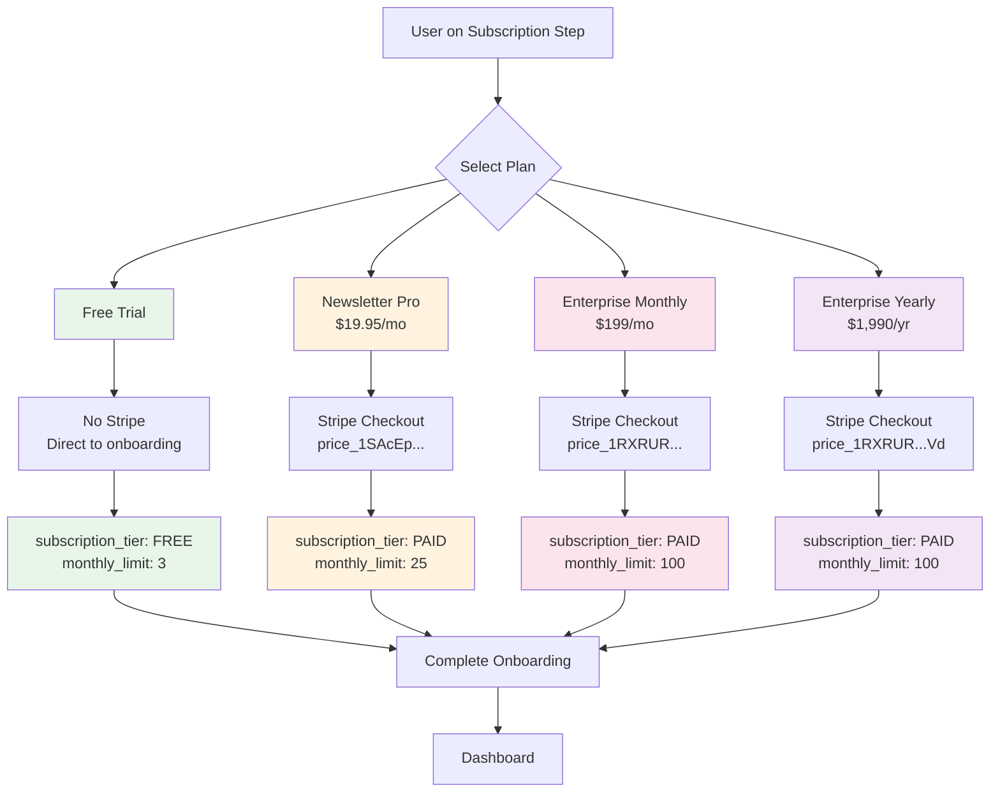

---

## API Endpoint Relationships 🔗

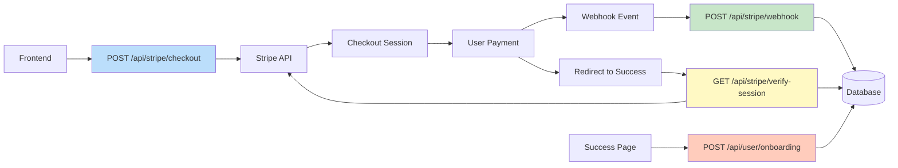

---

## State Diagram: Subscription Status 🔄

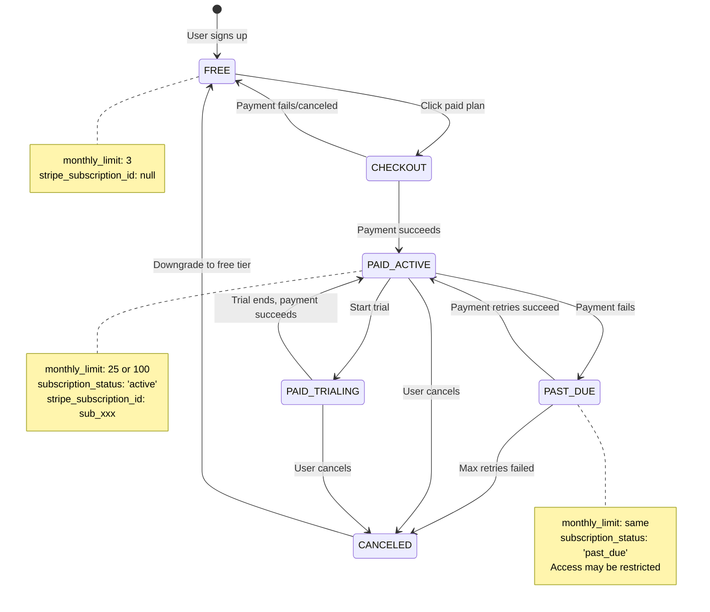

---

## Database Schema Flow 📊

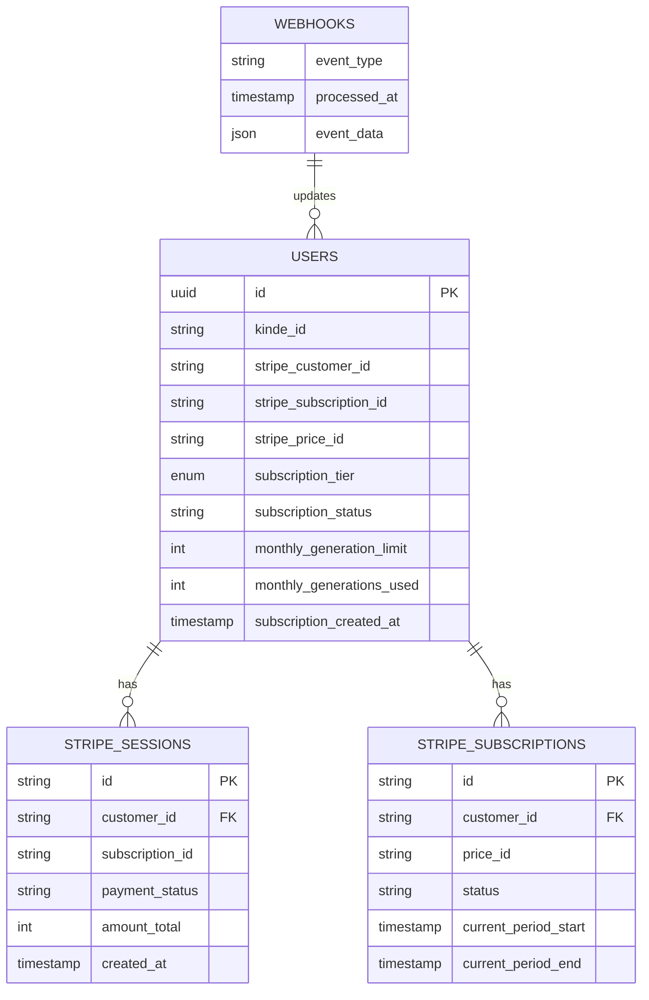

---

## Security Checks Flow 🔒

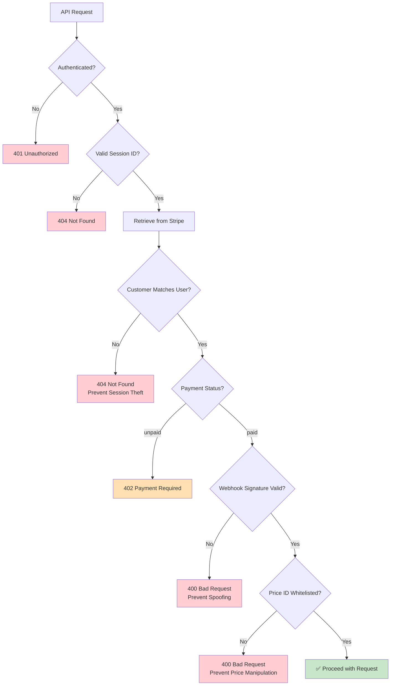

---

## Testing Flow Chart 🧪

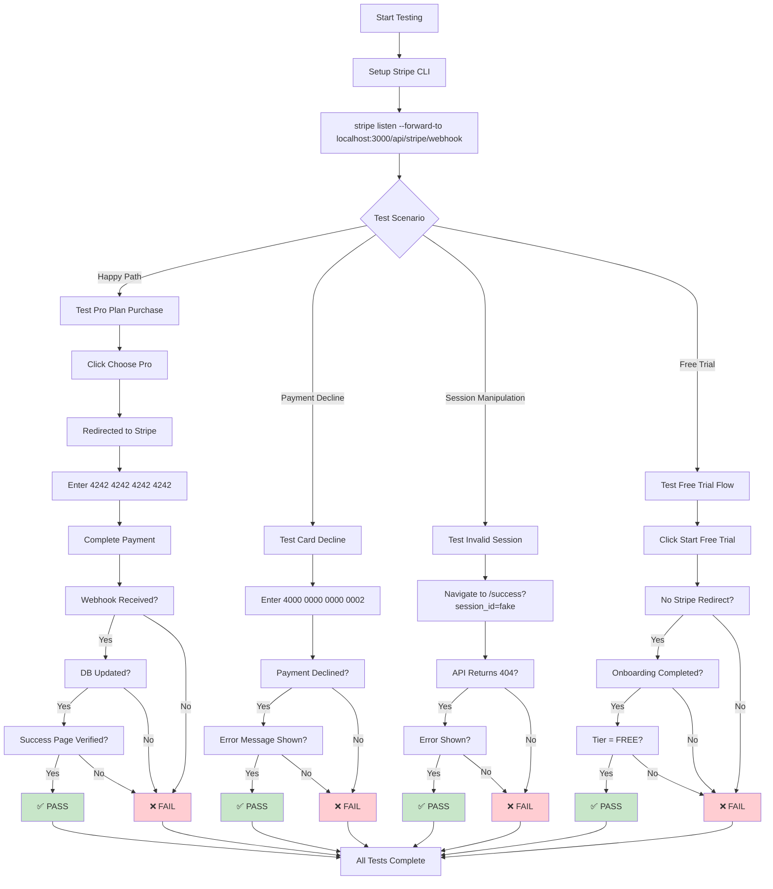

---

## Deployment Flow 🚀

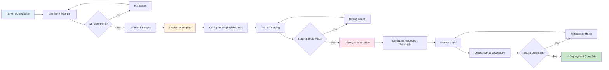

---

## Documentation Map 📚

```
STRIPE_CHECKOUT_API_DESIGN.md (Full Design)
├── Executive Summary
├── Current State Analysis
│   ├── subscription-step.tsx (BROKEN)
│   ├── /api/stripe/checkout (UNUSED)
│   ├── /api/stripe/webhook (WORKING)
│   ├── success/page.tsx (NO VERIFICATION)
│   └── /api/user/onboarding (NO CHECKS)
├── Proposed Architecture
│   ├── API Flow Diagram
│   └── Endpoint Specifications
├── Implementation Plan
│   ├── Phase 1: Backend APIs
│   ├── Phase 2: Frontend Integration
│   ├── Phase 3: Testing
│   └── Phase 4: Monitoring
└── Security Considerations

STRIPE_CHECKOUT_QUICK_REFERENCE.md (Quick Ref)
├── TL;DR
├── API Endpoints Summary
├── Frontend Changes Summary
├── Environment Variables
├── Testing Commands
└── Implementation Checklist

STRIPE_FLOW_DIAGRAMS.md (This File)
├── Current Flow (BROKEN)
├── Proposed Flow (FIXED)
├── Free Trial Flow
├── Webhook Event Handling
├── Session Verification Flow
├── Error Handling Flow
├── Multi-Tier Support
├── State Diagrams
└── Testing Flow
```

---

## Quick Reference: File Locations

```
📁 /Users/jarrettstanley/Desktop/websites/TrueToneAI-Newsletter/

Backend APIs:
├── src/app/api/stripe/
│   ├── checkout/route.ts           ← UPDATE (accept priceId)
│   ├── verify-session/route.ts     ← CREATE (new endpoint)
│   └── webhook/route.ts            ← UPDATE (multi-tier support)
└── src/app/api/user/onboarding/route.ts  ← UPDATE (verify subscription)

Frontend:
├── src/components/onboarding/steps/
│   └── subscription-step.tsx       ← UPDATE (call checkout API)
└── src/app/onboarding/success/page.tsx   ← UPDATE (verify session)

Database:
└── prisma/migrations/
    └── xxx_add_price_id.sql        ← CREATE (add stripe_price_id column)

Documentation:
└── docs/
    ├── STRIPE_CHECKOUT_API_DESIGN.md      ← Full design doc
    ├── STRIPE_CHECKOUT_QUICK_REFERENCE.md ← Quick reference
    └── STRIPE_FLOW_DIAGRAMS.md            ← This file
```

---

## Next Steps

1. **Review** these diagrams with team
2. **Approve** the proposed architecture
3. **Implement** Phase 1 (Backend APIs)
4. **Test** with Stripe CLI
5. **Deploy** to staging
6. **Monitor** and iterate

---

*For detailed implementation instructions, see `/docs/STRIPE_CHECKOUT_API_DESIGN.md`*
*For quick command reference, see `/docs/STRIPE_CHECKOUT_QUICK_REFERENCE.md`*
